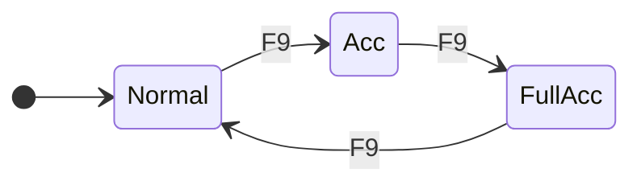
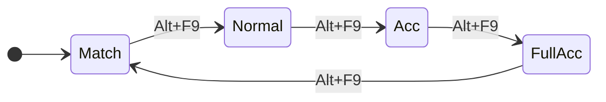
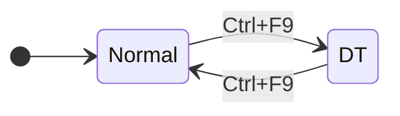
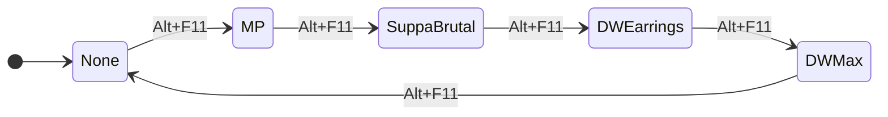
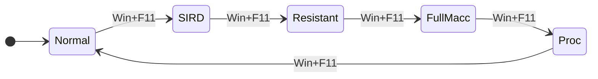
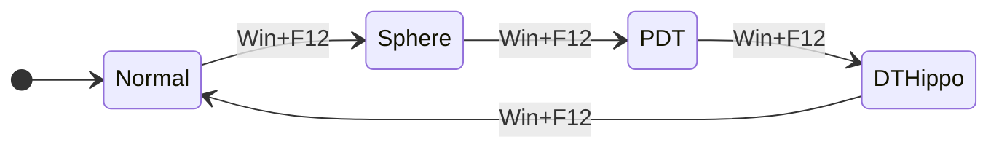
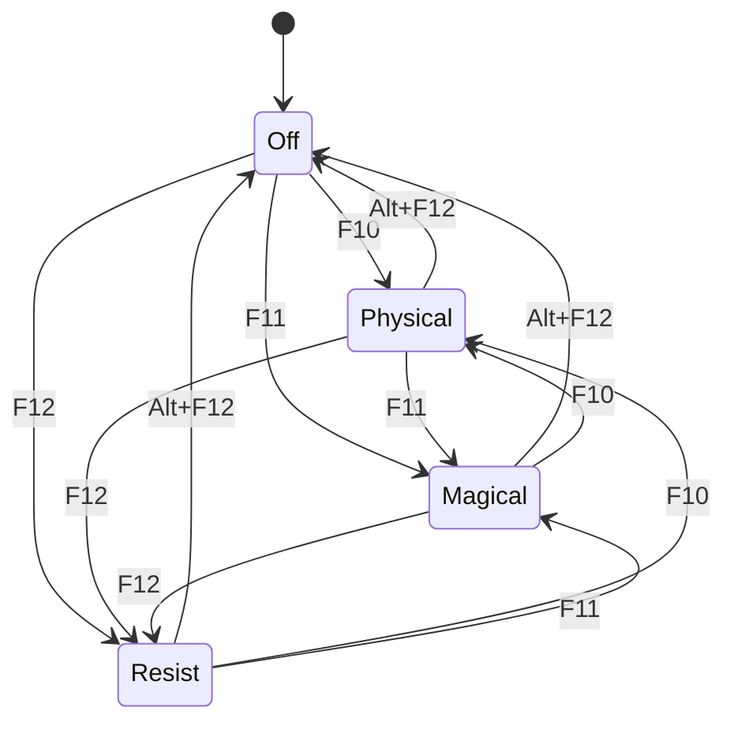
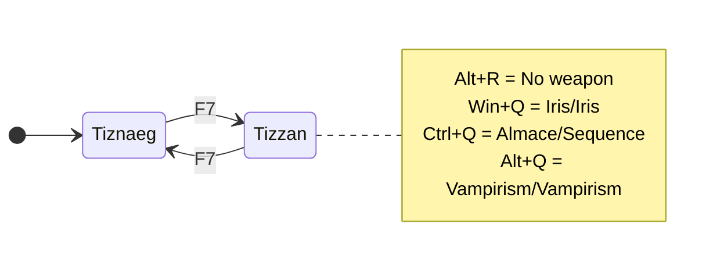

# BLU Toggle States & Mode Reference
**Character:** Mashengo | **Job:** Blue Mage (BLU)
**Files:** `data/Mashengo/Mashengo_Blu_Gear.lua`, `data/Mashengo/Mashengo-Globals.lua`, `BLU.lua`

---

## Overview

This document details every toggleable state, cycled mode, and boolean flag available when playing BLU as Mashengo. States are grouped by category and include their options, default values, keybindings, and the gear sets they influence.

---

## 1. Offense Modes

### OffenseMode
Controls melee accuracy/damage tradeoff for engaged sets.

| Option | Description |
|--------|-------------|
| `Normal` | *(default)* Standard TP/damage balance |
| `Acc` | Accuracy-focused melee set |
| `FullAcc` | Maximum accuracy melee set |

**Keybind:** `F9` — cycle OffenseMode



---

### WeaponskillMode
Controls weaponskill gear selection.

| Option | Description |
|--------|-------------|
| `Match` | *(default)* Auto-selects best WS set based on context |
| `Normal` | Standard WS damage set |
| `Acc` | Accuracy-focused WS set |
| `FullAcc` | Maximum accuracy WS set |

**Keybind:** `Alt+F9` — cycle WeaponskillMode



---

### HybridMode
Controls defense layered on top of melee sets while engaged.

| Option | Description |
|--------|-------------|
| `Normal` | *(default)* No defensive overlay |
| `DT` | Damage-taken gear overlaid on engaged sets |

**Keybind:** `Ctrl+F9` — cycle HybridMode



---

### ExtraMeleeMode
Applies an additional set layered on top of the engaged set. Used for situational adjustments.

| Option | Description |
|--------|-------------|
| `None` | *(default)* No overlay |
| `MP` | Equips MP-conserving earrings (Suppanomimi + Ethereal) |
| `SuppaBrutal` | Suppanomimi + Brutal Earring |
| `DWEarrings` | Dudgeon + Heartseeker earrings for dual-wield |
| `DWMax` | Maximum dual-wield set (earrings + Adhemar body + Reiki Yotai + Carmine Cuisses) |

**Keybind:** `Alt+F11` — cycle ExtraMeleeMode



---

## 2. Casting Modes

### CastingMode
Controls how Blue Magic and other spells are cast — balancing damage vs. accuracy vs. safety.

| Option | Description |
|--------|-------------|
| `Normal` | *(default)* Standard damage/potency sets |
| `SIRD` | Spell Interruption Rate Down — defensive cast set for high-danger situations |
| `Resistant` | High magic accuracy for resistant targets |
| `FullMacc` | Maximum magic accuracy (`MagicAccuracy` set) |
| `Proc` | Fast-cast gear for proc/blue magic learning attempts |

**Keybind:** `Win+F11` — cycle CastingMode



> **Note:** `Proc` mode equips fast-cast gear instead of nuking gear, which helps register learning procs. `Fodder` is a gear-set variant (used for party/fodder content) applied via `OffenseMode` context.

---

## 3. Idle & Defense Modes

### IdleMode
Controls the gear set used when resting or standing idle (not engaged).

| Option | Description |
|--------|-------------|
| `Normal` | *(default)* Standard idle with Refresh/MP regen |
| `Sphere` | Replaces body with Mekosu. Harness for Atomos/Sphere content |
| `PDT` | Physical Damage Taken idle set (Sakpata + Nyame) |
| `DTHippo` | PDT set with Hippo. Socks +1 for extra movement speed |

**Keybind:** `Win+F12` — cycle IdleMode



---

### DefenseMode + PhysicalDefenseMode
Hard defense modes that fully override your current gear set.

| DefenseMode | Sub-option | Gear Focus |
|-------------|------------|------------|
| `Physical` → `PDT` | Only option | Full Nyame set with Defending Ring + Shadow Ring |
| `Magical` → `MDT` | Only option | Nyame + Warder's Charm + Moonlight Cape |
| `Resist` → `MEVA` | Only option | Malignance + Vengeful/Purity rings for magic evasion |

**Keybinds:**
- `F10` — activate Physical defense
- `Ctrl+F10` — cycle PhysicalDefenseMode
- `F11` — activate Magical defense
- `Ctrl+F11` — cycle MagicalDefenseMode
- `F12` — activate Resist defense
- `Ctrl+F12` — cycle ResistDefenseMode
- `Alt+F12` — **reset** DefenseMode (turn off)



---

## 4. Weapons

### Weapons (cycle)
Swaps the main/sub weapon loadout.

| Option | Main | Sub |
|--------|------|-----|
| `Tiznaeg` | *(default)* Tizona | Naegling |
| `Tizzan` | Tizona | Zantetsuken |

**Keybind:** `F7` — cycle Weapons (between defined options)

Additional weapon swaps via dedicated binds:

| Bind | Set Name | Main | Sub |
|------|----------|------|-----|
| `Alt+R` | None | *(no weapon)* | — |
| `Win+Q` | MaccWeapons | Iris | Iris |
| `Ctrl+Q` | Almace | Almace | Sequence |
| `Alt+Q` | HybridWeapons | Vampirism | Vampirism |

> Other gear-file-defined sets (Tizalmace, Tizbron, MeleeClubs, Naegbron, Naegmace) exist but have no default keybind — use `gs c weapons <SetName>`.



---

## 5. Automation Toggles (Boolean Flags)

These are on/off toggles — no cycling.

### AutoWSMode
Automatically uses the set `autows` weaponskill when TP is available.
- **Default:** Off
- **`autows`:** `'Expiacion'` (or context-swapped per `autows_list`: `Tizzan → Savage Blade`, `Tiznaeg → Chant du Cygne`)
- **Keybind:** `Alt+Win+Ctrl+F7`

---

### AutoNukeMode
Automatically casts nukes in rotation.
- **Default:** Off
- **Keybind:** `Win+F8`

---

### AutoStunMode
Automatically uses stun spells.
- **Default:** Off
- **Keybind:** `Ctrl+F8`

---

### AutoFoodMode
Automatically uses food (`autofood = 'Soy Ramen'`).
- **Default:** Off
- **Keybind:** `Alt+Ctrl+F7`

---

### AutoTrustMode
Automatically summons trusts.
- **Default:** Off
- **Keybind:** `Ctrl+Win+Alt+F8`

---

### AutoDefenseMode
Automatically activates a defense set when taking damage.
- **Default:** Off
- **Keybind:** `Alt+F8`

---

### LearningMode (BLU-specific)
Keeps `Assim. Bazu. +4` gloves equipped at all times (for Blue Magic skill/learning).
- **Default:** Off
- **Keybind:** `Win+F10`

---

### AutoUnbridled (BLU-specific)
Automatically activates Unbridled Learning before casting spells that require it.
- **Default:** Off
- **Usage:** Enabled internally; no dedicated keybind — controlled via `state.AutoUnbridled`

---

### UndeadMode (BLU-specific)
Swaps `Sanguine Blade` → `Chant du Cygne` automatically when targeting undead mobs (prevents Sanguine from healing them and damaging you).
- **Default:** Off
- **Keybind:** `Win+F9`

---

### Capacity
Keeps the Capacity Mantle equipped and uses Capacity Rings.
- **Default:** Off
- **Keybind:** `Ctrl+Z`

---

### Kiting
Keeps `Carmine Cuisses +1` equipped for movement speed.
- **Default:** Off
- **Keybind:** `Alt+F10`

---

### AutoBuffMode (cycle)
Automatically maintains self-buffs. Cycles through configured profiles.

| Option | Description |
|--------|-------------|
| `Off` | *(default)* No automatic buffing |
| `Auto` | Keeps Erratic Flutter, Battery Charge/Refresh, Nat. Meditation, Mighty Guard up based on status (Always/Idle/Engaged/Combat) |
| `Default` | Full self-buff suite: Erratic Flutter, Battery Charge, Phalanx/Barrier Tusk, Stoneskin, Occultation/Blink, Mighty Guard, Nat. Meditation |
| `Cleave` | Cleave-focused buffs: Erratic Flutter, Battery Charge, Phalanx/Barrier Tusk, Stoneskin, Occultation/Blink, Carcharian Verve, Memento Mori |

**Keybind:** `Win+Pause` — cycle AutoBuffMode

```mermaid
stateDiagram-v2
    direction LR
    [*] --> Off
    Off --> Auto : Win+Pause
    Auto --> Default : Win+Pause
    Default --> Cleave : Win+Pause
    Cleave --> Off : Win+Pause
```

---

## 6. TreasureMode

Controls whether Treasure Hunter gear is worn during actions.

| Option | Description |
|--------|-------------|
| `None` | *(default)* No TH gear |
| `Tag` | Equips TH set during magical BLU spell midcast |
| `SATA` | Full TH mode (via standard include logic) |

**Keybind:** `Ctrl+T` — cycle TreasureMode

---

## 7. Active Buff States (Auto-tracked)

These are **not cycled by the player** — they update automatically based on active game buffs and influence gear sets dynamically.

| State | Gear Effect |
|-------|-------------|
| `Burst Affinity` | Adds `Assim. Shalwar +3` (legs) + `Hashi. Basmak +1` (feet) during midcast |
| `Chain Affinity` | Adds `Assim. Charuqs +2` (feet) during midcast |
| `Azure Lore` | Triggers Magic Burst set during Magical BLU midcast |
| `Convergence` | Adds `Luh. Keffiyeh +3` (head) during midcast |
| `Diffusion` | Adds `Luhlaza Charuqs +3` (feet) during midcast |
| `Efflux` | Adds Rosmerta's Cape (back) + `Hashishin Tayt +1` (legs) |
| `Aftermath: Lv.3` | Adds `AM` suffix to CustomMeleeGroups for engaged set variant |
| `Unbridled Learning` | Bypasses Unbridled Learning cast check |
| `Unbridled Wisdom` | Bypasses Unbridled Learning cast check |
| `Doom` | Equips Eshmun's Ring ×2 |

---

## 8. BLU-Specific Keybinds (Combat Actions)

These trigger game abilities/macros directly rather than gear state changes.

| Keybind | Action |
|---------|--------|
| `Ctrl+\`` | `/ja "Chain Affinity" <me>` |
| `Win+\`` | `/ja "Efflux" <me>` |
| `Alt+\`` | `/ja "Burst Affinity" <me>` |
| `Ctrl+Win+Alt+\`` | `gs c cycle MagicBurstMode` |
| `Win+Backspace` | `/ja "Convergence" <me>` |
| `Ctrl+Backspace` | Unbridled Learning → Diffusion → Mighty Guard (macro chain) |
| `Alt+Backspace` | Unbridled Learning → Diffusion → Carcharian Verve (macro chain) |

---

## 9. Full State Map

```mermaid
graph TD
    BLU[BLU State Machine]

    BLU --> OFFENSE[Offense]
    BLU --> DEFENSE[Defense]
    BLU --> CASTING[Casting]
    BLU --> WEAPONS[Weapons]
    BLU --> AUTOMATION[Automation]
    BLU --> BUFFS[Active Buffs]

    OFFENSE --> OM[OffenseMode\nNormal / Acc / FullAcc]
    OFFENSE --> HM[HybridMode\nNormal / DT]
    OFFENSE --> WM[WeaponskillMode\nMatch / Normal / Acc / FullAcc]
    OFFENSE --> EMM[ExtraMeleeMode\nNone / MP / SuppaBrutal / DWEarrings / DWMax]

    DEFENSE --> IDL[IdleMode\nNormal / Sphere / PDT / DTHippo]
    DEFENSE --> PDT[PhysicalDefenseMode\nPDT]
    DEFENSE --> MDT[MagicalDefenseMode\nMDT]
    DEFENSE --> MEVA[ResistDefenseMode\nMEVA]
    DEFENSE --> KIT[Kiting Toggle]

    CASTING --> CM[CastingMode\nNormal / SIRD / Resistant / FullMacc / Proc]
    CASTING --> LRN[LearningMode Toggle]
    CASTING --> UNB[AutoUnbridled Toggle]
    CASTING --> UNDEAD[UndeadMode Toggle]
    CASTING --> MB[MagicBurstMode]

    WEAPONS --> WPN[Weapons\nTiznaeg / Tizzan]
    WEAPONS --> WPNALT[Alt Binds\nNone / MaccWeapons / Almace / HybridWeapons]

    AUTOMATION --> ABM[AutoBuffMode\nOff / Auto / Default / Cleave]
    AUTOMATION --> AWS[AutoWSMode Toggle]
    AUTOMATION --> ANK[AutoNukeMode Toggle]
    AUTOMATION --> AST[AutoStunMode Toggle]
    AUTOMATION --> AFD[AutoFoodMode Toggle]
    AUTOMATION --> ATR[AutoTrustMode Toggle]
    AUTOMATION --> ADM[AutoDefenseMode Toggle]
    AUTOMATION --> CAP[Capacity Toggle]
    AUTOMATION --> TRS[TreasureMode\nNone / Tag / SATA]

    BUFFS --> BA[Burst Affinity]
    BUFFS --> CA[Chain Affinity]
    BUFFS --> AZ[Azure Lore]
    BUFFS --> CV[Convergence]
    BUFFS --> DF[Diffusion]
    BUFFS --> EF[Efflux]
    BUFFS --> AM3[Aftermath Lv.3]
    BUFFS --> UBL[Unbridled Learning]
    BUFFS --> UBW[Unbridled Wisdom]
    BUFFS --> DOOM[Doom]
```



---

## 10. Quick-Reference Cheat Sheet

| F-Key | Modifier | Action |
|-------|----------|--------|
| F7 | — | Cycle Weapons |
| F7 | Alt+Win+Ctrl | Toggle AutoWSMode |
| F8 | Win | Toggle AutoNukeMode |
| F8 | Ctrl | Toggle AutoStunMode |
| F8 | Alt | Toggle AutoDefenseMode |
| F8 | Ctrl+Win+Alt | Toggle AutoTrustMode |
| F9 | — | Cycle OffenseMode |
| F9 | Ctrl | Cycle HybridMode |
| F9 | Win | **BLU:** Toggle UndeadMode |
| F9 | Alt | Cycle WeaponskillMode |
| F10 | — | Set DefenseMode → Physical |
| F10 | Ctrl | Cycle PhysicalDefenseMode |
| F10 | Win | **BLU:** Toggle LearningMode |
| F10 | Alt | Toggle Kiting |
| F11 | — | Set DefenseMode → Magical |
| F11 | Ctrl | Cycle MagicalDefenseMode |
| F11 | Win | Cycle CastingMode |
| F11 | Alt | Cycle ExtraMeleeMode |
| F12 | — | Set DefenseMode → Resist |
| F12 | Ctrl | Cycle ResistDefenseMode |
| F12 | Win | Cycle IdleMode |
| F12 | Alt | Reset DefenseMode (off) |
| F12 | Ctrl+Win+Alt | Reload GearSwap |
| Pause | — | Update/refresh gear |
| Pause | Win | Cycle AutoBuffMode |

| Other Key | Modifier | Action |
|-----------|----------|--------|
| `` ` `` | Ctrl | Chain Affinity |
| `` ` `` | Win | Efflux |
| `` ` `` | Alt | Burst Affinity |
| `` ` `` | Ctrl+Win+Alt | Cycle MagicBurstMode |
| Backspace | Win | Convergence |
| Backspace | Ctrl | UL + Diffusion + Mighty Guard |
| Backspace | Alt | UL + Diffusion + Carcharian Verve |
| Backspace | Ctrl+Win+Alt | BuffUp macro |
| Q | Win | Weapons → MaccWeapons (Iris/Iris) |
| Q | Ctrl | Weapons → Almace |
| Q | Alt | Weapons → HybridWeapons (Vampirism/Vampirism) |
| R | Alt | Weapons → None |
| R | Ctrl | Weapons → Default |
| T | Ctrl | Cycle TreasureMode |
| Z | Ctrl | Toggle Capacity |
| Y | Ctrl | Toggle AutoCleanupMode |
