# NIN Toggle States & Mode Reference
**Character:** Mashengo | **Job:** Ninja (NIN)
**Files:** `data/Mashengo/Mashengo_Nin_Gear.lua`, `data/Mashengo/Mashengo-Globals.lua`, `NIN.lua`

---

## Overview

This document details every toggleable state, cycled mode, and boolean flag available when playing NIN as Mashengo. States are grouped by category and include their options, default values, keybindings, and the gear sets they influence.

---

## 1. Offense Modes

### OffenseMode
Controls melee accuracy/damage tradeoff for engaged sets.

| Option | Description |
|--------|-------------|
| `Normal` | *(default)* Standard TP/damage balance |
| `SomeAcc` | Light accuracy-focused melee set |
| `Acc` | Accuracy-focused melee set |
| `FullAcc` | Maximum accuracy melee set |
| `Fodder` | Low-content / fodder encounter set |
| `Crit` | Critical hit-focused melee set |

**Keybind:** `F9` — cycle OffenseMode

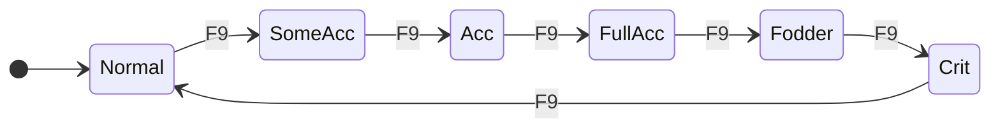

---

### WeaponskillMode
Controls weaponskill gear selection.

| Option | Description |
|--------|-------------|
| `Match` | *(default)* Auto-selects best WS set based on context |
| `Normal` | Standard WS damage set |
| `SomeAcc` | Light accuracy-focused WS set |
| `Acc` | Accuracy-focused WS set |
| `FullAcc` | Maximum accuracy WS set |
| `Fodder` | Low-content WS set |
| `Proc` | Fast-cast gear for proc/skillchain attempts |

**Keybind:** `Alt+F9` — cycle WeaponskillMode
**Shortcut:** `Alt+R` — set WeaponskillMode → `Proc` and CastingMode → `Proc`
**Shortcut:** `Ctrl+R` — reset WeaponskillMode → `Normal` and CastingMode → `Normal`, re-equip weapons

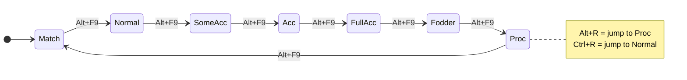

---

### HybridMode
Controls defense layered on top of melee sets while engaged.

| Option | Description |
|--------|-------------|
| `Normal` | *(default)* No defensive overlay |
| `DT` | Damage-taken gear overlaid on engaged sets |

**Keybind:** `Ctrl+F9` — cycle HybridMode

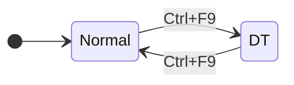

---

### RangedMode
Controls ranged accuracy for thrown/ranged attacks.

| Option | Description |
|--------|-------------|
| `Normal` | *(default)* Standard ranged set |
| `Acc` | Accuracy-focused ranged set |

**Keybind:** `Win+F9` — cycle RangedMode

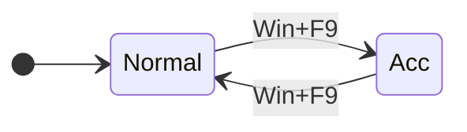

---

### ExtraMeleeMode
Applies an additional set layered on top of the engaged set. Used for situational adjustments.

| Option | Description |
|--------|-------------|
| `None` | *(default)* No overlay |
| `SuppaBrutal` | Suppanomimi + Brutal Earring |
| `DWEarrings` | Dual-wield earrings overlay |
| `DWMax` | Maximum dual-wield set |

**Keybind:** `Alt+F11` — cycle ExtraMeleeMode

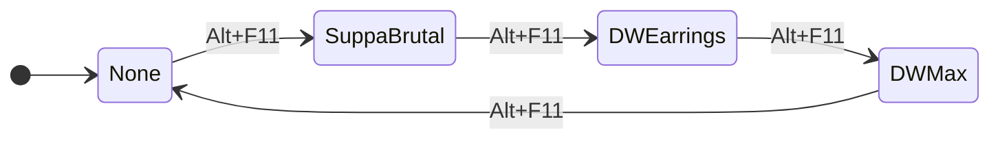

---

## 2. Casting Modes

### CastingMode
Controls how Ninjutsu spells are cast — balancing damage vs. accuracy vs. safety.

| Option | Description |
|--------|-------------|
| `Normal` | *(default)* Standard nuke potency sets |
| `Proc` | Fast-cast gear for proc/learning attempts |
| `Resistant` | High magic accuracy for resistant targets |

**Keybind:** `Win+F11` — cycle CastingMode
**Shortcut:** `Alt+R` — set CastingMode → `Proc` (simultaneously with WeaponskillMode)
**Shortcut:** `Ctrl+R` — set CastingMode → `Normal` (simultaneously with WeaponskillMode)

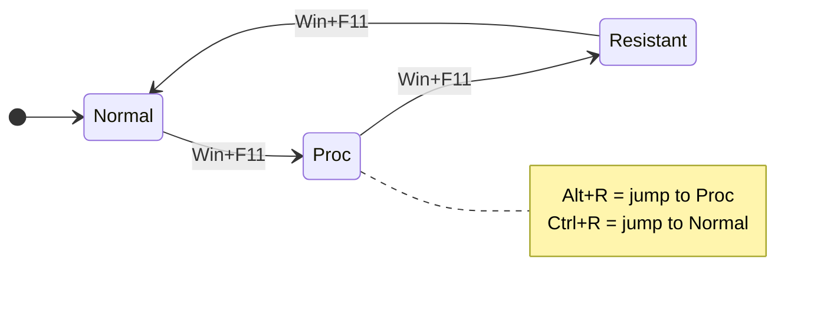

> **Note:** `Proc` mode equips fast-recast gear instead of nuking gear to help register proc attempts. `ElementalMode` controls which element's ninjutsu is used for nuking.

---

### ElementalMode
Selects which element is used when casting elemental Ninjutsu via `gs c elemental`.

| Option | Description |
|--------|-------------|
| `Fire` | Katon series |
| `Water` | Suiton series |
| `Lightning` | Raiton series |
| `Earth` | Doton series |
| `Wind` | Huton series |
| `Ice` | Hyoton series |
| `Light` | Light-element ninjutsu |
| `Dark` | Dark-element ninjutsu |

**Command:** `gs c cycle ElementalMode` (no default keybind — use macro or command)

> **Usage:** `gs c elemental nuke` casts the highest available tier of the selected element's Ninjutsu. `gs c elemental San/Ni/Ichi` casts that specific tier.

---

## 3. Idle & Defense Modes

### IdleMode
Controls the gear set used when resting or standing idle (not engaged).

| Option | Description |
|--------|-------------|
| `Normal` | *(default)* Standard idle set |
| `Sphere` | Alternate body (e.g. Mekosu. Harness) for Sphere content |

**Keybind:** `Win+F12` — cycle IdleMode

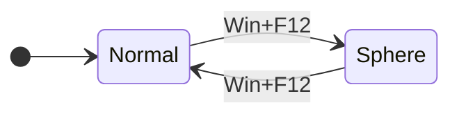

---

### DefenseMode + Sub-modes
Hard defense modes that fully override your current gear set.

| DefenseMode | Sub-option | Gear Focus |
|-------------|------------|------------|
| `Physical` → `PDT` | Only option | Physical damage-taken reduction set |
| `Magical` → `MDT` | Only option | Magical damage-taken reduction set |
| `Resist` → `MEVA` | Only option | Magic evasion set |

**Keybinds:**
- `F10` — activate Physical defense
- `Ctrl+F10` — cycle PhysicalDefenseMode
- `F11` — activate Magical defense
- `Ctrl+F11` — cycle MagicalDefenseMode
- `F12` — activate Resist defense
- `Ctrl+F12` — cycle ResistDefenseMode
- `Alt+F12` — **reset** DefenseMode (turn off)

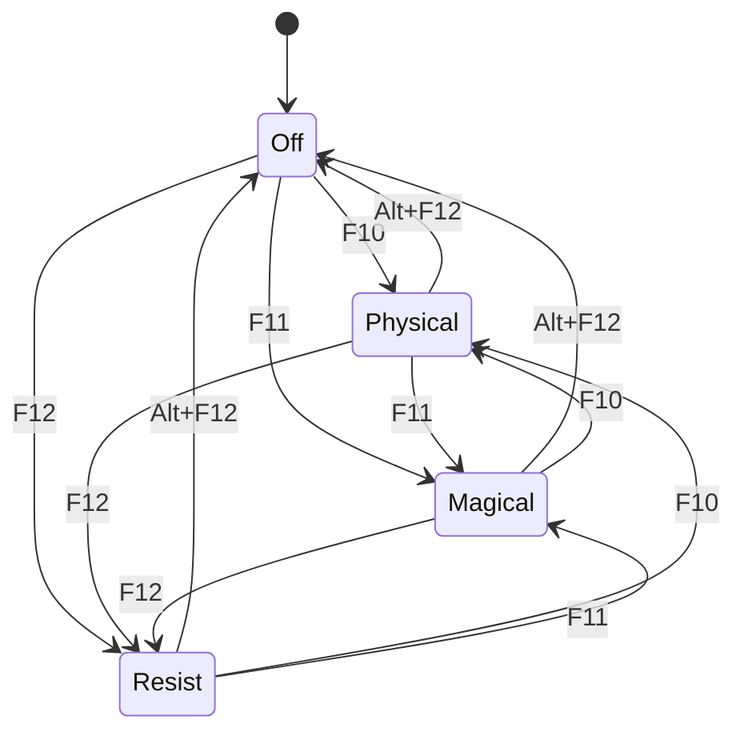

---

## 4. Stance (NIN-Specific)

### Stance
Tracks which ninja stance is active and auto-maintains it in combat when `check_stance()` fires each tick.

| Option | Description |
|--------|-------------|
| `Innin` | Maintains Innin; overlays `sets.buff.Innin` on melee in Normal/Fodder OffenseMode with no defense |
| `Yonin` | Maintains Yonin; overlays `sets.buff.Yonin` on melee unless in DT/Evasion defense |
| `None` | *(default)* No stance maintained |

**Direct JA keybinds (activate manually):**
- `Ctrl+`` — `/ja "Innin" <me>`
- `Alt+`` — `/ja "Yonin" <me>`

> **Note:** Setting `state.Stance` to `Innin` or `Yonin` tells the auto-tick system to reapply that stance whenever it lapses in combat. The gear overlays (sets.buff.Innin / sets.buff.Yonin) are applied automatically based on the active buff, not the Stance state directly.

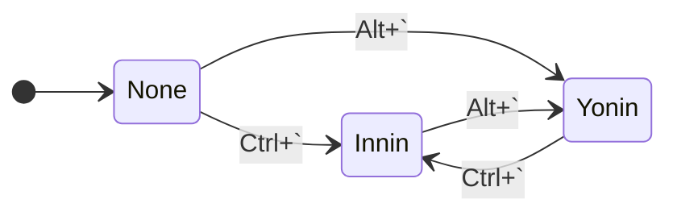

---

## 5. Weapons

### Weapons (cycle)
Swaps the main/sub weapon loadout.

| Option | Main | Sub |
|--------|------|-----|
| `Heishi` | *(default)* Heishi Shorinken | Kunimitsu |
| `Savage` | Naegling | Kunimitsu |
| `Evisceration` | Tauret | Kunimitsu |

**Keybind:** `F7` — cycle Weapons
**Reset:** `Ctrl+R` — `gs c weapons Default` (returns to Heishi set, resets modes)

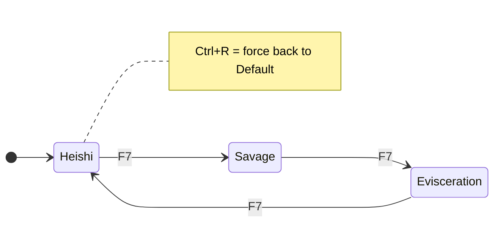

> **Tip:** `Ctrl+R` also resets WeaponskillMode to Normal and CastingMode to Normal in one action.

---

## 6. Automation Toggles (Boolean Flags)

These are on/off toggles — no cycling.

### AutoWSMode
Automatically uses the set `autows` weaponskill (`"Blade: Shun"`) when TP is available.
- **Default:** Off
- **Keybind:** `Alt+Win+Ctrl+F7`

---

### AutoNukeMode
Automatically casts ninjutsu nukes in rotation.
- **Default:** Off
- **Keybind:** `Win+F8`

---

### AutoStunMode
Automatically uses stun spells.
- **Default:** Off
- **Keybind:** `Ctrl+F8`

---

### AutoFoodMode
Automatically uses food (`autofood = 'Soy Ramen'`).
- **Default:** Off
- **Keybind:** `Alt+Ctrl+F7`

---

### AutoTrustMode
Automatically summons trusts.
- **Default:** Off
- **Keybind:** `Ctrl+Win+Alt+F8`

---

### AutoDefenseMode
Automatically activates a defense set when taking damage.
- **Default:** Off
- **Keybind:** `Alt+F8`

---

### AutoShadowMode
Automatically recasts Utsusemi shadows as needed.
- **Default:** Off
- **Command:** `gs c toggle AutoShadowMode`

---

### Capacity
Keeps the Capacity Mantle equipped and uses Capacity Rings.
- **Default:** Off
- **Keybind:** `Ctrl+Z`

---

### Kiting
Keeps movement-speed gear equipped.
- **Default:** Off
- **Keybind:** `Alt+F10`

---

### AutoBuffMode (cycle)
Automatically maintains self-buffs. Cycles through configured profiles.

| Option | Buffs Maintained |
|--------|-----------------|
| `Off` | *(default)* No automatic buffing |
| `Auto` | Migawari: Ichi (Combat only) |
| `Default` | Myoshu: Ichi (Subtle Blow+), Kakka: Ichi (Store TP) |

**Keybind:** `Win+Pause` — cycle AutoBuffMode

```mermaid
stateDiagram-v2
    direction LR
    [*] --> Off
    Off --> Auto : Win+Pause
    Auto --> Default : Win+Pause
    Default --> Off : Win+Pause
```

---

## 7. Active Buff States (Auto-tracked)

These are **not cycled by the player** — they update automatically based on active game buffs and influence gear sets dynamically.

| State | Gear Effect |
|-------|-------------|
| `Migawari` | Overlays `sets.buff.Migawari` on idle and melee sets |
| `Yonin` | Overlays `sets.buff.Yonin` on melee sets (unless DT/Evasion defense active) |
| `Innin` | Overlays `sets.buff.Innin` on melee sets (Normal/Fodder OffenseMode only, no defense) |
| `Futae` | Overlays `sets.buff.Futae` on ElementalNinjutsu midcast sets |
| `Aftermath: Lv.3` | Appends `'AM'` to CustomMeleeGroups for Nagi AM engaged set variant |
| `Doom` | Equips Doom-counter gear via `sets.buff.Doom` |

---

## 8. MagicBurstMode

Controls whether Magic Burst gear (`sets.MagicBurst`) is equipped during Elemental Ninjutsu midcast.

| Option | Description |
|--------|-------------|
| `Off` | *(default)* No burst gear |
| `Single` | Equips burst gear once then auto-resets to Off |
| `On` | Continuously equips burst gear |

> Configured via `gs c cycle MagicBurstMode` or `gs c set MagicBurstMode Single` — no default keybind on NIN.

---

## 9. NIN-Specific Keybinds (Combat Actions)

These trigger game abilities/macros directly rather than gear state changes.

| Keybind | Action |
|---------|--------|
| `Ctrl+`` | `/ja "Innin" <me>` |
| `Alt+`` | `/ja "Yonin" <me>` |
| `Win+`` | `gs c cycle SkillchainMode` |
| `Alt+R` | Set WeaponskillMode → Proc + CastingMode → Proc |
| `Ctrl+R` | Reset weapons to Default + WeaponskillMode → Normal + CastingMode → Normal |

---

## 10. Full State Map

```mermaid
graph TD
    NIN[NIN State Machine]

    NIN --> OFFENSE[Offense]
    NIN --> DEFENSE[Defense]
    NIN --> CASTING[Casting]
    NIN --> STANCE[Stance]
    NIN --> WEAPONS[Weapons]
    NIN --> AUTOMATION[Automation]
    NIN --> BUFFS[Active Buffs]

    OFFENSE --> OM[OffenseMode\nNormal / SomeAcc / Acc / FullAcc / Fodder / Crit]
    OFFENSE --> HM[HybridMode\nNormal / DT]
    OFFENSE --> WM[WeaponskillMode\nMatch / Normal / SomeAcc / Acc / FullAcc / Fodder / Proc]
    OFFENSE --> RM[RangedMode\nNormal / Acc]
    OFFENSE --> EMM[ExtraMeleeMode\nNone / SuppaBrutal / DWEarrings / DWMax]

    DEFENSE --> IDL[IdleMode\nNormal / Sphere]
    DEFENSE --> PDT[PhysicalDefenseMode\nPDT]
    DEFENSE --> MDT[MagicalDefenseMode\nMDT]
    DEFENSE --> MEVA[ResistDefenseMode\nMEVA]
    DEFENSE --> KIT[Kiting Toggle]

    CASTING --> CM[CastingMode\nNormal / Proc / Resistant]
    CASTING --> EM[ElementalMode\nFire / Water / Lightning / Earth / Wind / Ice / Light / Dark]
    CASTING --> MB[MagicBurstMode\nOff / Single / On]

    STANCE --> ST[Stance\nNone / Innin / Yonin]

    WEAPONS --> WPN[Weapons\nHeishi / Savage / Evisceration]

    AUTOMATION --> ABM[AutoBuffMode\nOff / Auto / Default]
    AUTOMATION --> AWS[AutoWSMode Toggle]
    AUTOMATION --> ANK[AutoNukeMode Toggle]
    AUTOMATION --> AST[AutoStunMode Toggle]
    AUTOMATION --> AFD[AutoFoodMode Toggle]
    AUTOMATION --> ATR[AutoTrustMode Toggle]
    AUTOMATION --> ADM[AutoDefenseMode Toggle]
    AUTOMATION --> ASH[AutoShadowMode Toggle]
    AUTOMATION --> CAP[Capacity Toggle]
    AUTOMATION --> TRS[TreasureMode]

    BUFFS --> MIG[Migawari]
    BUFFS --> YON[Yonin]
    BUFFS --> INN[Innin]
    BUFFS --> FUT[Futae]
    BUFFS --> AM3[Aftermath Lv.3]
    BUFFS --> DOOM[Doom]
```

---

## 11. Quick-Reference Cheat Sheet

| F-Key | Modifier | Action |
|-------|----------|--------|
| F7 | — | Cycle Weapons |
| F7 | Alt+Win+Ctrl | Toggle AutoWSMode |
| F8 | Win | Toggle AutoNukeMode |
| F8 | Ctrl | Toggle AutoStunMode |
| F8 | Alt | Toggle AutoDefenseMode |
| F8 | Ctrl+Win+Alt | Toggle AutoTrustMode |
| F9 | — | Cycle OffenseMode |
| F9 | Ctrl | Cycle HybridMode |
| F9 | Win | Cycle RangedMode |
| F9 | Alt | Cycle WeaponskillMode |
| F10 | — | Set DefenseMode → Physical |
| F10 | Ctrl | Cycle PhysicalDefenseMode |
| F10 | Alt | Toggle Kiting |
| F11 | — | Set DefenseMode → Magical |
| F11 | Ctrl | Cycle MagicalDefenseMode |
| F11 | Win | Cycle CastingMode |
| F11 | Alt | Cycle ExtraMeleeMode |
| F12 | — | Set DefenseMode → Resist |
| F12 | Ctrl | Cycle ResistDefenseMode |
| F12 | Win | Cycle IdleMode |
| F12 | Alt | Reset DefenseMode (off) |
| F12 | Ctrl+Win+Alt | Reload GearSwap |
| Pause | — | Update/refresh gear |
| Pause | Win | Cycle AutoBuffMode |

| Other Key | Modifier | Action |
|-----------|----------|--------|
| `` ` `` | Ctrl | `/ja "Innin" <me>` |
| `` ` `` | Alt | `/ja "Yonin" <me>` |
| `` ` `` | Win | Cycle SkillchainMode |
| R | Alt | Set WeaponskillMode + CastingMode → Proc |
| R | Ctrl | Reset Weapons to Default + modes to Normal |
| Z | Ctrl | Toggle Capacity |
| T | Ctrl | Cycle TreasureMode |
| Y | Ctrl | Toggle AutoCleanupMode |
| F7 | Alt+Ctrl | Toggle AutoFoodMode |
