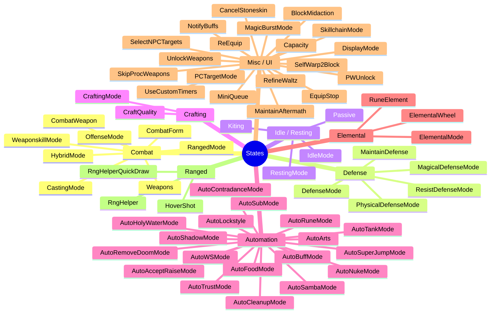
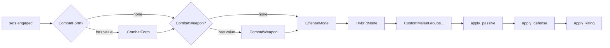
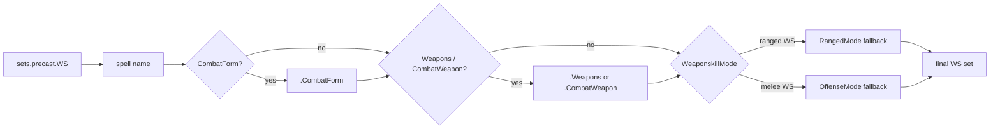
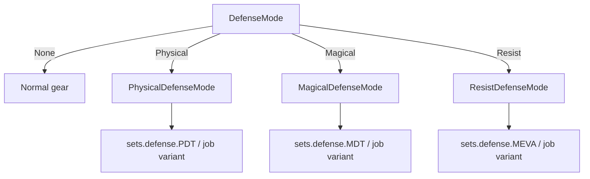
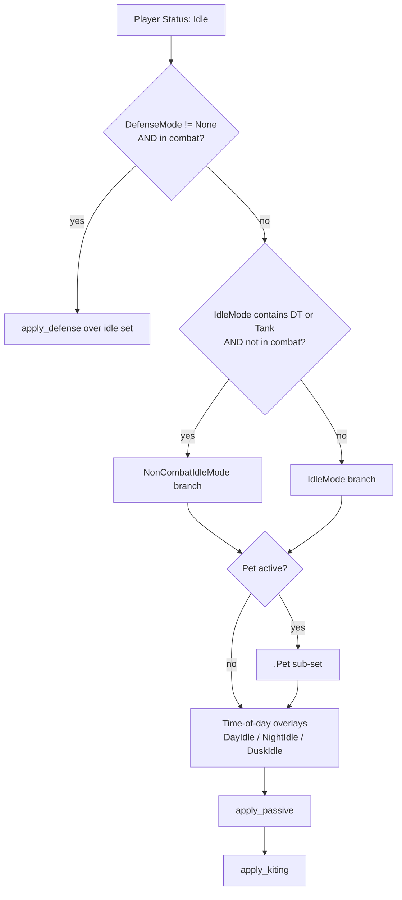
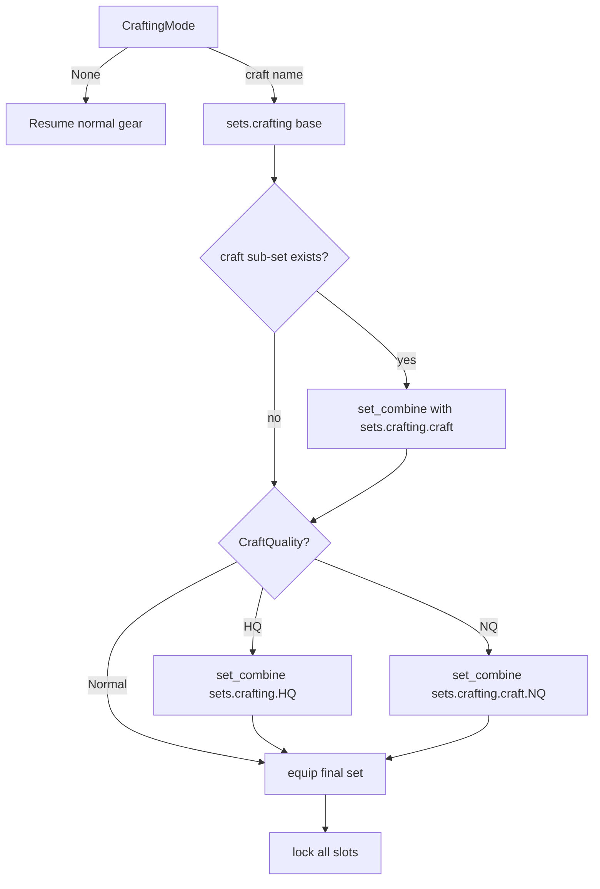
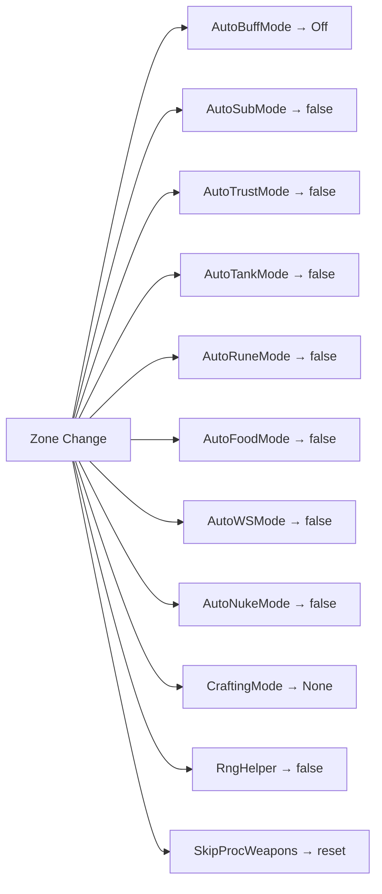

# Sel-Include State Reference

This document describes every state variable defined in `Sel-Include.lua`. States drive gear selection, automation behavior, and combat logic across all jobs.

---

## How to Use States

```
//gs c set <state> <value>       -- set to a specific value
//gs c cycle <state>             -- advance to next option
//gs c cycleback <state>         -- go to previous option
//gs c toggle <state>            -- flip a boolean state
//gs c reset <state>             -- return to default
//gs c reset all                 -- reset every state
```

State names are **case-insensitive** in commands. Use the description string shown in brackets or the Lua key name.

---

## State Categories



---

## Combat States

These states control which gear set is equipped during melee, weaponskills, and casting.

### Gear set selection order (Engaged / Melee)



### Gear set selection order (Weaponskill)



---

### `state.OffenseMode`
| Key | `OffenseMode` |
|-----|---------------|
| Description | `"Offense Mode"` |
| Type | Multi-value (job-defined options) |
| Default | `Normal` |
| Command | `//gs c cycle offensemode` |

Controls the primary melee/TP set variant. Common values jobs define: `Normal`, `Acc`, `Hybrid`, etc. Applied as the first major branch in `sets.engaged`.

---

### `state.HybridMode`
| Key | `HybridMode` |
|-----|--------------|
| Description | `"Hybrid Mode"` |
| Type | Multi-value (job-defined options) |
| Default | `Normal` |
| Command | `//gs c cycle hybridmode` |

Applied as the second branch inside `sets.engaged[OffenseMode]`. Used for PDT/MDT overlays while still meleeing. If a value contains `"MDT"`, the MDT defense set is automatically combined during `silent_check_disable()` situations.

---

### `state.RangedMode`
| Key | `RangedMode` |
|-----|--------------|
| Description | `"Ranged Mode"` |
| Type | Multi-value (job-defined options) |
| Default | `Normal` |
| Command | `//gs c cycle rangedmode` |

Controls the ranged attack set variant. Also used as a fallback `WeaponskillMode` override for ranged weaponskills when the WS mode doesn't directly contain a matching value.

---

### `state.WeaponskillMode`
| Key | `WeaponskillMode` |
|-----|-------------------|
| Description | `"Weaponskill Mode"` |
| Type | Multi-value — default options: `Match` |
| Default | `Match` |
| Command | `//gs c cycle weaponskillmode` |

- `Match` — attempts to select a WS set sub-key that matches the current `OffenseMode` or `RangedMode` value.
- `Proc` — equips `sets.precast.WS.Proc` (used for proc-farming in Abyssea/VW).
- Job files commonly add `Acc`, `AtmaAcc`, etc.

---

### `state.CastingMode`
| Key | `CastingMode` |
|-----|---------------|
| Description | `"Casting Mode"` |
| Type | Multi-value (job-defined options) |
| Default | `Normal` |
| Command | `//gs c cycle castingmode` |

Applied as a branch inside midcast sets. If a value contains `"DT"`, the DT sub-set is skipped outside of combat. If it contains `"SIRD"`, the SIRD sub-set is skipped outside of combat. Common values: `Normal`, `Resistant`, `Enmity`, `DT`, `SIRD`.

---

### `state.CombatForm`
| Key | `CombatForm` |
|-----|--------------|
| Description | `"Combat Form"` |
| Type | String mode (free-form value) |
| Default | empty (no value) |
| Command | `//gs c set combatform <value>` |

Highest-priority branch in both melee and WS set trees. Used for alternate stances — e.g., `DW` on NIN, `Staff` on BLM/SCH. Only applied when `has_value` is true.

---

### `state.CombatWeapon`
| Key | `CombatWeapon` |
|-----|----------------|
| Description | `"Combat Weapon"` |
| Type | String mode (free-form value) |
| Default | empty (no value) |
| Command | `//gs c set combatweapon <value>` |

Applied inside the `CombatForm` branch. Used to differentiate sets by equipped weapon type when `CombatForm` alone is insufficient.

---

### `state.Weapons`
| Key | `Weapons` |
|-----|-----------|
| Description | `"Weapons"` |
| Type | Multi-value (job-defined) |
| Default | `Weapons` (mage: `None`) |
| Command | `//gs c cycle weapons` |

Selects which `sets.weapons[value]` entry to equip. Special behavior:
- `None` — unlocks all weapon slots and lets Gearswap manage them freely.
- Values containing `DW` or `Dual` are automatically skipped if the player cannot dual-wield.
- Values containing `Proc` are skipped when `SkipProcWeapons` is active.
- Changing `Weapons` can trigger a macro page change via `weapons_pagelist` and auto-select a WS via `autows_list`.

---

## Defense States



### `state.DefenseMode`
| Key | `DefenseMode` |
|-----|---------------|
| Description | `"Defense Mode"` |
| Options | `None`, `Physical`, `Magical`, `Resist` |
| Default | `None` |
| Command | `//gs c cycle defensemode` |

Top-level toggle for emergency defense. When not `None`, defense gear is blended over idle/melee sets. Automatically resets to `None` when leaving combat (if `AutoDefenseMode` is set by the job).

---

### `state.PhysicalDefenseMode`
| Key | `PhysicalDefenseMode` |
|-----|----------------------|
| Description | `"Physical Defense Mode"` |
| Options | `PDT` (+ job-defined) |
| Default | `PDT` |
| Command | `//gs c cycle physicaldefensemode` |

Active when `DefenseMode` = `Physical`. Selects sub-set within `sets.defense`.

---

### `state.MagicalDefenseMode`
| Key | `MagicalDefenseMode` |
|-----|----------------------|
| Description | `"Magical Defense Mode"` |
| Options | `MDT` (+ job-defined) |
| Default | `MDT` |
| Command | `//gs c cycle magicaldefensemode` |

Active when `DefenseMode` = `Magical`.

---

### `state.ResistDefenseMode`
| Key | `ResistDefenseMode` |
|-----|---------------------|
| Description | `"Resistance Defense Mode"` |
| Options | `MEVA` (+ job-defined) |
| Default | `MEVA` |
| Command | `//gs c cycle resistdefensemode` |

Active when `DefenseMode` = `Resist`. Intended for status resistance sets.

---

### `state.MaintainDefense`
| Key | `MaintainDefense` |
|-----|-------------------|
| Description | `"Maintain Defense"` |
| Type | Boolean |
| Default | `false` |
| Command | `//gs c toggle maintaindefense` |

When true, keeps defense mode active even when it would normally auto-reset (e.g. on zone or combat end). Job-specific behavior — consumed by job files.

---

## Idle and Resting States



### `state.IdleMode`
| Key | `IdleMode` |
|-----|------------|
| Description | `"Idle Mode"` |
| Type | Multi-value (job-defined) |
| Default | `Normal` |
| Command | `//gs c cycle idlemode` |

Controls the idle set variant. Standard job values: `Normal`, `DT`, `Tank`, `Sphere`, `DT-Sphere`. Values containing `DT` or `Tank` activate the `NonCombatIdleMode` branch when out of combat.

---

### `state.RestingMode`
| Key | `RestingMode` |
|-----|---------------|
| Description | `"Resting Mode"` |
| Type | Multi-value (job-defined) |
| Default | `Normal` |
| Command | `//gs c cycle restingmode` |

Controls `sets.resting[RestingMode]`. Used to swap rest sets (e.g., refresh vs. HP recovery focus).

---

### `state.Kiting`
| Key | `Kiting` |
|-----|----------|
| Description | `"Kiting"` |
| Type | Boolean |
| Default | `false` |
| Command | `//gs c toggle kiting` |

When enabled (or when idle and moving with no defense/passive active), equips `sets.Kiting` over the base set for movement-speed gear.

---

### `state.Passive`
| Key | `Passive` |
|-----|-----------|
| Description | `"Passive Mode"` |
| Options | `None` (+ job-defined) |
| Default | `None` |
| Command | `//gs c cycle passive` |

When not `None`, combines `sets.passive[Passive.value]` over the current set. Used for persistent passive overlays (e.g., refresh, DT) that sit below defense but above base sets.

---

## Crafting States



### `state.CraftingMode`
| Key | `CraftingMode` |
|-----|----------------|
| Description | `"Crafting Mode"` |
| Options | `None`, `Alchemy`, `Bonecraft`, `Clothcraft`, `Cooking`, `Fishing`, `Goldsmithing`, `Leathercraft`, `Smithing`, `Woodworking` |
| Default | `None` |
| Command | `//gs c set craftingmode <craft>` |

When set to a craft, equips the corresponding `sets.crafting[craft]` (merged over `sets.crafting` base) and **locks all gear slots** to prevent accidental swaps. Automatically triggered when the player gains an `*Imagery` buff (Moogle synthesis support). Resets on zone.

---

### `state.CraftQuality`
| Key | `CraftQuality` |
|-----|----------------|
| Description | `"Crafting Quality"` |
| Options | `Normal`, `HQ`, `NQ` |
| Default | `Normal` |
| Command | `//gs c set craftquality <value>` |

Applied on top of the craft set:
- `HQ` — overlays `sets.crafting.HQ` (e.g., Craftmaster's Ring).
- `NQ` — overlays `sets.crafting[craft].NQ` (craft-specific NQ ring).

---

## Elemental States

### `state.ElementalMode`
| Key | `ElementalMode` |
|-----|-----------------|
| Description | `"Elemental Mode"` |
| Options | `Fire`, `Ice`, `Wind`, `Earth`, `Lightning`, `Water`, `Light`, `Dark` |
| Default | `Fire` |
| Command | `//gs c cycle elementalmode` |

Tracks the active element for nuking. Used by BLM/SCH/GEO/COR to select elemental gear and spell targets. When `ElementalWheel` is on, advances automatically after each nuke (skipping Light and Dark).

---

### `state.RuneElement`
| Key | `RuneElement` |
|-----|---------------|
| Description | `"Rune Element"` |
| Options | `Ignis`, `Gelus`, `Flabra`, `Tellus`, `Sulpor`, `Unda`, `Lux`, `Tenebrae` |
| Default | `Ignis` |
| Command | `//gs c cycle runeelement` |

Tracks which Rune element to imbue on RUN. Triggers a `DisplayRune` update on change.

---

### `state.ElementalWheel`
| Key | `ElementalWheel` |
|-----|-----------------|
| Description | `"Elemental Wheel"` |
| Type | Boolean |
| Default | `false` |
| Command | `//gs c toggle elementalwheel` |

When enabled, `ElementalMode` automatically cycles forward (skipping Light/Dark) after each elemental nuke lands.

---

## Automation States

These are boolean or limited-option states that enable automated in-game behaviors.

| State | Default | Description |
|-------|---------|-------------|
| `AutoWSMode` | `false` | Automatically fires a weaponskill at `autowstp` TP. Resets on zone. |
| `AutoWSRestore` | `true` | After a WS, re-equips TP gear instead of staying in WS gear. |
| `AutoNukeMode` | `false` | Automatically casts the `autonuke` spell. Resets on zone. |
| `AutoBuffMode` | `Off` / `Auto` | Automatically casts job buffs. `Auto` enables; `Off` disables. Resets on zone. |
| `AutoFoodMode` | `false` | Automatically uses food when it expires or is absent. Resets on zone. |
| `AutoSambaMode` | `Off`, `Haste Samba`, `Aspir Samba`, `Drain Samba II` | Auto-dances the selected samba on DNC (or /DNC). Forces `Off` if DNC is not main or sub. |
| `AutoRuneMode` | `false` | Automatically imprints Runes on RUN. Resets on zone. |
| `AutoShadowMode` | `false` | Automatically recasts Utsusemi when shadows drop on NIN. |
| `AutoContradanceMode` | `true` | Automatically uses Contradance when ready on DNC. |
| `AutoHolyWaterMode` | `true` | Automatically uses Holy Water when Doom is applied. |
| `AutoRemoveDoomMode` | `true` | Automatically casts Cursna/Divine Veil to remove Doom. |
| `AutoSubMode` | `false` | Automatically triggers Sublimation on SCH. Resets on zone. |
| `AutoTankMode` | `false` | Enables tank-specific automation (flash, provoke, etc.). Resets on zone. |
| `AutoTrustMode` | `false` | Automatically summons trusts on zone-in. Resets on zone. |
| `AutoArts` | `false` | Automatically applies Light Arts or Dark Arts on SCH based on spell cast. |
| `AutoAcceptRaiseMode` | `false` | Automatically accepts raise when offered. |
| `AutoSuperJumpMode` | `false` | Automatically uses Super Jump on DRG when HP falls below a threshold. |
| `AutoCleanupMode` | `false` | Automatically uses Forbidden Keys on Sturdy Pyxis and turns in bayld items to NPCs on target. |
| `AutoLockstyle` | `false` | Automatically runs lockstyle when the `Weapons` state changes. |

Commands follow the pattern `//gs c toggle <key>` or `//gs c set <key> <value>` for the multi-option ones.

---

## Ranged States

### `state.RngHelper`
| Key | `RngHelper` |
|-----|-------------|
| Description | `"RngHelper"` |
| Type | Boolean |
| Default | `false` |
| Command | `//gs c toggle rnghelper` |

Enables Snaps's RngHelper extension for automatic ranged attack management. Sends `gs rh enable` / `gs rh disable` to the extension on change. Resets on zone.

---

### `state.HoverShot`
| Key | `HoverShot` |
|-----|-------------|
| Description | `"HoverShot"` |
| Type | Boolean |
| Default | `true` |
| Command | `//gs c toggle hovershot` |

Controls whether HoverShot logic is applied during ranged attacks (COR/RNG). On by default.

---

### `state.RngHelperQuickDraw`
| Key | `RngHelperQuickDraw` |
|-----|----------------------|
| Description | `"RngHelperQuickDraw"` |
| Type | Boolean |
| Default | `false` |
| Command | `//gs c toggle rnghelpersquickdraw` |

Enables QuickDraw integration within RngHelper on COR.

---

## Targeting States

### `state.PCTargetMode`
| Key | `PCTargetMode` |
|-----|----------------|
| Description | `"PC Target Mode"` |
| Options | `default`, `stpt`, `stal`, `stpc` |
| Default | `default` |
| Command | `//gs c cycle pctargetmode` |

Controls how healing spells retarget when the original target is a player character. Maps to Gearswap's built-in `pc_target` behavior.

| Value | Behavior |
|-------|----------|
| `default` | Use spell's original target |
| `stpt` | Redirect to party member `<stpt>` |
| `stal` | Redirect to alliance member `<stal>` |
| `stpc` | Redirect to any PC `<stpc>` |

---

### `state.SelectNPCTargets`
| Key | `SelectNPCTargets` |
|-----|-------------------|
| Description | `"Select NPC Targets"` |
| Type | Boolean |
| Default | `false` |
| Command | `//gs c toggle selectnpctargets` |

When true, allows auto-targeting of NPCs for certain spells/abilities. Used in conjunction with PCTargetMode.

---

## Misc / UI States

### `state.DisplayMode`
| Key | `DisplayMode` |
|-----|---------------|
| Description | `"Display Mode"` |
| Type | Boolean |
| Default | `true` |
| Command | `//gs c toggle displaymode` |

Controls whether the on-screen job state HUD is shown and updated. Calls `update_job_states()` after every state change.

---

### `state.UseCustomTimers`
| Key | `UseCustomTimers` |
|-----|------------------|
| Description | `"Use Custom Timers"` |
| Type | Boolean |
| Default | `true` |
| Command | `//gs c toggle usecustomtimers` |

Enables Gearswap's custom ability timer overlay (replaces or supplements native timers).

---

### `state.MagicBurstMode`
| Key | `MagicBurstMode` |
|-----|------------------|
| Description | `"Magic Burst Mode"` |
| Options | `Off`, `Single`, `Lock` |
| Default | `Off` |
| Command | `//gs c cycle magicburstmode` |

When not `Off`, equips `sets.MagicBurst` during post-midcast of nukes.
- `Single` — applies once, then resets to `Off`.
- `Lock` — stays active until manually reset.

---

### `state.SkillchainMode`
| Key | `SkillchainMode` |
|-----|------------------|
| Description | `"Skillchain Mode"` |
| Options | `Off`, `Single`, `Lock` |
| Default | `Off` |
| Command | `//gs c cycle skillchainmode` |

When not `Off`, equips `sets.Skillchain` during weaponskill precast.
- `Single` — applies once then resets.
- `Lock` — stays until manually reset.

---

### `state.EquipStop`
| Key | `EquipStop` |
|-----|-------------|
| Description | `"Stop Equipping Gear"` |
| Options | `off`, `precast`, `midcast`, `pet_midcast` |
| Default | `off` |
| Command | `//gs c set equipstop <value>` |

Debugging tool: stops gear equipping at the specified phase. Useful for inspecting what set would be applied.

| Value | Stops after |
|-------|-------------|
| `off` | Normal operation |
| `precast` | Locks after precast |
| `midcast` | Locks after midcast |
| `pet_midcast` | Locks after pet midcast |

---

### `state.Capacity`
| Key | `Capacity` |
|-----|------------|
| Description | `"Capacity Mode"` |
| Type | Boolean |
| Default | `false` |
| Command | `//gs c toggle capacity` |

When true, combines `sets.Capacity` over melee/idle sets (e.g., for Capacity Points ring). Also removes a Capacity Points ring slot lock when the Commitment/Dedication buff ends.

---

### `state.ReEquip`
| Key | `ReEquip` |
|-----|-----------|
| Description | `"ReEquip Mode"` |
| Type | Boolean |
| Default | `false` |
| Command | `//gs c toggle reequip` |

When true, periodically checks and re-equips the correct weapon set if it drifts (e.g., due to item use). Useful on jobs where weapon swaps happen frequently.

---

### `state.UnlockWeapons`
| Key | `UnlockWeapons` |
|-----|-----------------|
| Description | `"Unlock Weapons"` |
| Type | Boolean |
| Default | `false` |
| Command | `//gs c toggle unlockweapons` |

Temporarily unlocks weapon slots (enable main/sub/range/ammo) so they can be changed freely, then re-equips the current weapon set when turned off. Used internally when sleeping to equip Berserker's Torque or similar.

---

### `state.SkipProcWeapons`
| Key | `SkipProcWeapons` |
|-----|------------------|
| Description | `"Skip Proc Weapons"` |
| Type | Boolean |
| Default | `false` (forced `false` in Abyssea/proc zones and when Voidwatcher buff is gained) |
| Command | `//gs c toggle skipprocweapons` |

When true, `Weapons` options containing `"Proc"` are skipped when cycling. Auto-set to `false` in proc farming zones.

---

### `state.CancelStoneskin`
| Key | `CancelStoneskin` |
|-----|------------------|
| Description | `"Auto Cancel Stoneskin"` |
| Type | Boolean |
| Default | `true` |
| Command | `//gs c toggle cancelstoneskin` |

When true and sleep/Lullaby is applied, automatically sends `cancel stoneskin` so the player can be woken by self-damage from Utsusemi or similar.

---

### `state.BlockMidaction`
| Key | `BlockMidaction` |
|-----|-----------------|
| Description | `"Block Midaction"` |
| Type | Boolean |
| Default | `true` |
| Command | `//gs c toggle blockmidaction` |

Controls whether actions are blocked while a midcast is in progress, preventing accidental double-casts.

---

### `state.MaintainAftermath`
| Key | `MaintainAftermath` |
|-----|---------------------|
| Description | `"Maintain Aftermath"` |
| Type | Boolean |
| Default | `true` |
| Command | `//gs c toggle maintainaftermath` |

When true, job files track Aftermath and avoid overwriting the weapon with a lower tier. Primarily for SAM/DRK with Empyrean weapons.

---

### `state.RefineWaltz`
| Key | `RefineWaltz` |
|-----|---------------|
| Description | `"RefineWaltz"` |
| Type | Boolean |
| Default | `true` |
| Command | `//gs c toggle refinewaltz` |

When true, automatically downgrades Curing Waltz to the lowest tier sufficient to top off the target's HP, conserving TP.

---

### `state.NotifyBuffs`
| Key | `NotifyBuffs` |
|-----|---------------|
| Description | `"Notify Buffs"` |
| Type | Boolean |
| Default | `false` |
| Command | `//gs c toggle notifybuffs` |

When true, prints a chat notification whenever a buff in `NotifyBuffs` set is gained or lost. Populate `NotifyBuffs = S{'Haste','Refresh',...}` to use.

---

### `state.SelfWarp2Block`
| Key | `SelfWarp2Block` |
|-----|-----------------|
| Description | `"Block Warp2 on Self"` |
| Type | Boolean |
| Default | `true` |
| Command | `//gs c toggle selfwarp2block` |

Blocks accidental self-cast of Warp II when true (line 992 in Sel-Include). Prevents warping yourself out during a battle.

---

### `state.MiniQueue`
| Key | `MiniQueue` |
|-----|-------------|
| Description | `"MiniQueue"` |
| Type | Boolean |
| Default | `true` |
| Command | `//gs c toggle miniqueue` |

Enables a small action queue for chaining abilities/spells without gaps during latency.

---

### `state.PWUnlock`
| Key | `PWUnlock` |
|-----|------------|
| Description | `"PWUnlock"` |
| Type | Boolean |
| Default | `false` |
| Command | `//gs c toggle pwunlock` |

Temporarily unlocks weapons for 3 seconds via `//gs c set unlockweapons true` → scheduled reset. Used as a pulse-unlock for sleep recovery scenarios where the player needs a brief window to reequip.

---

## Buff Tracking (`state.Buff`)

`state.Buff` is a table (not a mode) that mirrors specific buff states from `buffactive`. It exists because some buffs need to be tracked across the full cast cycle even when `buffactive` may not reflect them immediately.

| Key | Tracked Buff | Jobs |
|-----|-------------|------|
| `state.Buff['Light Arts']` | Light Arts active | SCH |
| `state.Buff['Addendum: White']` | Addendum: White active | SCH |
| `state.Buff['Dark Arts']` | Dark Arts active | SCH |
| `state.Buff['Addendum: Black']` | Addendum: Black active | SCH |
| `state.Buff['Accession']` | Accession active | SCH |
| `state.Buff['Manifestation']` | Manifestation active | SCH |
| `state.Buff['Warcry']` | Warcry active | WAR |
| `state.Buff['SJ Restriction']` | SJ Restriction (Grounds of Valor) | All |

These are auto-updated in `buff_change()`. Job files can also add their own keys by defining them in `buff_change` logic.

---

## State Lifecycle: Zone Change Resets

The following states automatically reset to their defaults when the player zones:



---

## Customization: Adding or Overriding States

States defined in `Sel-Include.lua` can be **extended or overridden** in your character/job gear file without editing the library:

```lua
-- In Mashengo_BLU_Gear.lua (or Mashengo-Globals.lua):

-- Add new options to an existing state:
state.HybridMode:options('Normal', 'PDT', 'MDT')

-- Define a brand-new state:
state.TankMode = M{['description'] = 'Tank Mode', 'Off', 'On'}

-- Override a default value:
state.MagicBurstMode:set('Lock')
```

Use `user_job_self_command(commandArgs, eventArgs)` to add commands that read your custom states.

---

*Source: [`libs/Sel-Include.lua`](../libs/Sel-Include.lua) — do not edit the library file directly.*
