# THF Toggle States & Mode Reference
**Character:** Mashengo | **Job:** Thief (THF)
**Files:** `data/Mashengo/Mashengo_Thf_Gear.lua`, `data/Mashengo/Mashengo-Globals.lua`, `THF.lua`

---

## Overview

This document details every toggleable state, cycled mode, and boolean flag available when playing THF as Mashengo. States are grouped by category and include their options, default values, keybindings, and the gear sets they influence.

---

## 1. Offense Modes

### OffenseMode
Controls melee accuracy/damage tradeoff for engaged sets.

| Option | Description |
|--------|-------------|
| `Normal` | *(default)* Standard TP/damage balance |
| `SomeAcc` | Light accuracy-focused melee set |
| `Acc` | Accuracy-focused melee set |
| `FullAcc` | Maximum accuracy melee set |
| `Fodder` | Low-content / fodder encounter set |

**Keybind:** `F9` — cycle OffenseMode

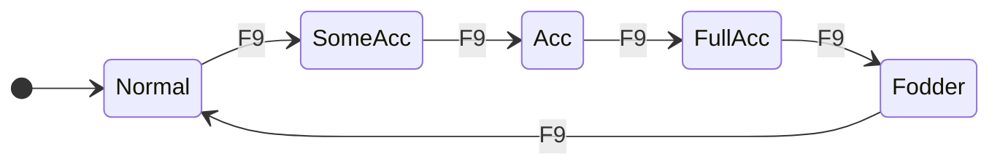

---

### WeaponskillMode
Controls weaponskill gear selection. Also determines which WS variant fires based on active SATA buffs.

| Option | Description |
|--------|-------------|
| `Match` | *(default)* Auto-selects best WS set based on context |
| `Normal` | Standard WS damage set |
| `DT` | Damage-taken overlay variant for WS (e.g. Rudra's Storm.DT) |
| `SomeAcc` | Light accuracy-focused WS set |
| `Acc` | Accuracy-focused WS set |
| `FullAcc` | Maximum accuracy WS set |
| `Fodder` | Low-content WS set |
| `Proc` | Proc/accuracy-focused set for skillchain attempts |

> **SATA variants:** When Sneak Attack or Trick Attack is active, the WS set resolves to `.SA`, `.TA`, or `.SATA` sub-variants automatically. This happens via `get_custom_wsmode()` and is independent of WeaponskillMode.

**Keybind:** `Alt+F9` — cycle WeaponskillMode

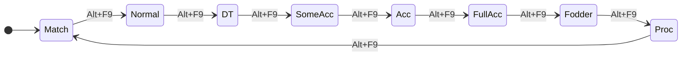

---

### HybridMode
Controls defense layered on top of melee sets while engaged.

| Option | Description |
|--------|-------------|
| `Normal` | *(default)* No defensive overlay |
| `DT` | Damage-taken gear overlaid on engaged sets |

**Keybind:** `Ctrl+F9` — cycle HybridMode

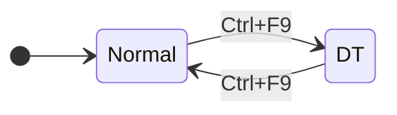

---

### RangedMode
Controls ranged accuracy for thrown/ranged attacks.

| Option | Description |
|--------|-------------|
| `Normal` | *(default)* Standard ranged set |
| `Acc` | Accuracy-focused ranged set |

**Keybind:** `Win+F9` — cycle RangedMode

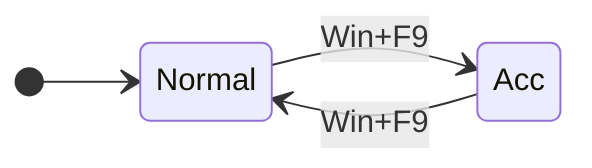

---

### ExtraMeleeMode
Applies an additional set layered on top of the engaged set. Used for situational adjustments.

| Option | Description |
|--------|-------------|
| `None` | *(default)* No overlay |
| `Suppa` | Suppanomimi + Sherida Earring for dual-wield |
| `DWMax` | Maximum dual-wield set (earrings + body + hands + waist) |
| `Parry` | Parry-focused gear overlay |

**Keybind:** `Alt+F11` — cycle ExtraMeleeMode

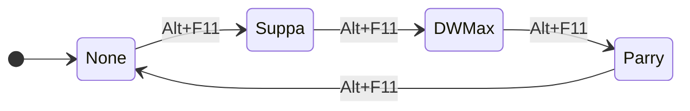

---

## 2. Treasure Hunter Mode (THF-Specific)

### TreasureMode
Controls when Treasure Hunter gear (`sets.TreasureHunter`) is equipped. Defaults to `Fulltime` on THF — the most aggressive TH setting.

| Option | Description |
|--------|-------------|
| `None` | Never equip TH gear |
| `Tag` | Equip TH gear on initial mob contact (melee hit, ranged hit, or Aeolian Edge AoE) |
| `SATA` | TH gear on initial contact and whenever Sneak/Trick Attack is used |
| `Fulltime` | *(default)* Keep TH gear equipped at all times in melee |

> **Aeolian Edge:** Always tags with TH gear regardless of TreasureMode (except `None`), since it is an AoE and typically used to tag multiple mobs.
> **Dia/Bio spells:** Midcast sets for Dia, Diaga, Dia II, Bio, and Bio II are merged with `sets.TreasureHunter` by default.

**Keybind:** `Ctrl+T` — cycle TreasureMode

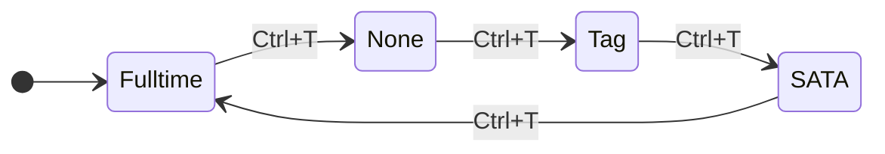

---

## 3. Idle & Defense Modes

### IdleMode
Controls the gear set used when resting or standing idle (not engaged).

| Option | Description |
|--------|-------------|
| `Normal` | *(default)* Standard idle with Malignance set |
| `Sphere` | Alternate body for Atomos/Sphere content |

**Keybind:** `Win+F12` — cycle IdleMode

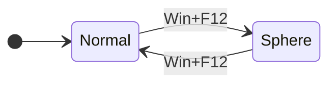

> **Note:** `sets.idle.Weak` is defined as a fallback for when recovering from weakness status.

---

### DefenseMode + Sub-modes
Hard defense modes that fully override your current gear set.

| DefenseMode | Sub-option | Gear Focus |
|-------------|------------|------------|
| `Physical` → `PDT` | Only option | Physical damage-taken reduction (Malignance + rings) |
| `Magical` → `MDT` | Only option | Magical damage-taken reduction (Engulfer Cape + Shadow Ring) |
| `Resist` → `MEVA` | Only option | Magic evasion (Vengeful/Purity rings) |

**Keybinds:**
- `F10` — activate Physical defense
- `Ctrl+F10` — cycle PhysicalDefenseMode
- `F11` — activate Magical defense
- `Ctrl+F11` — cycle MagicalDefenseMode
- `F12` — activate Resist defense
- `Ctrl+F12` — cycle ResistDefenseMode
- `Alt+F12` — **reset** DefenseMode (turn off)

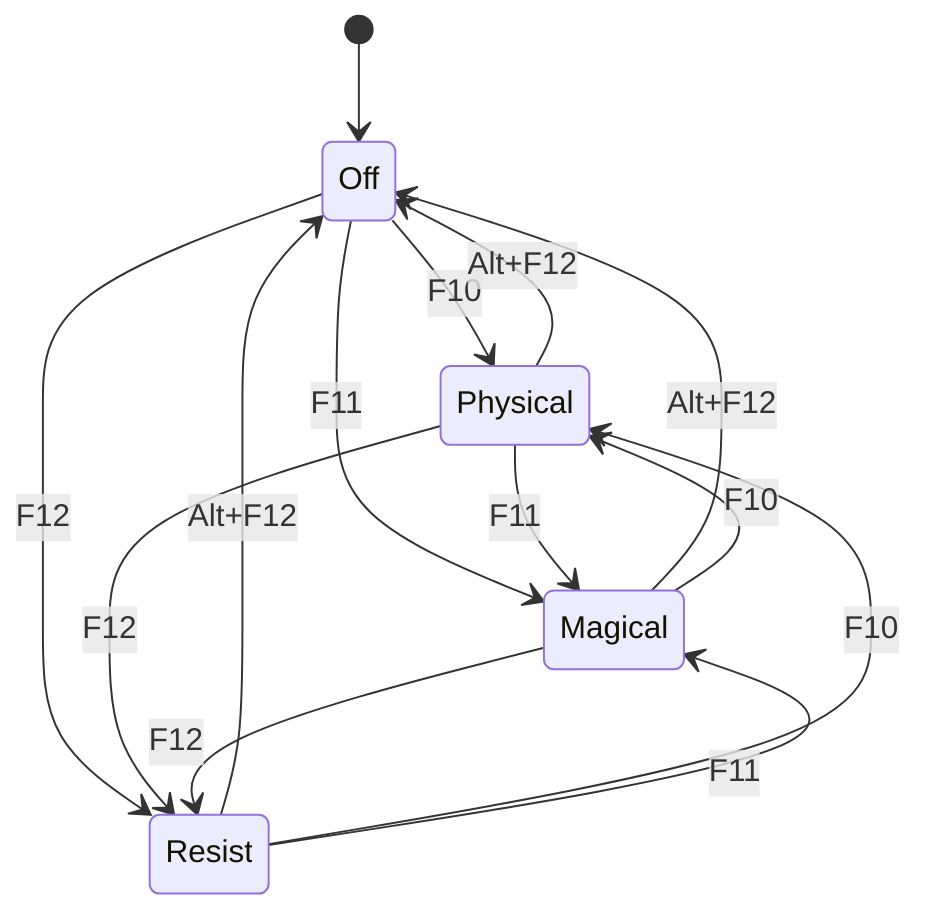

---

## 4. Weapons

### Weapons (cycle)
Swaps the main/sub/ranged weapon loadout. Each weapon set also determines which weaponskill `AutoWSMode` will use.

| Option | Main | Sub | Auto-WS |
|--------|------|-----|---------|
| `Evisceration` | *(default)* Tauret | Odium | Evisceration |
| `Aeneas` | Aeneas | Gleti's Knife | Rudra's Storm |
| `Aeolian` | Malevolence | Malevolence | Aeolian Edge |
| `Savage` | Naegling | Odium | Savage Blade |
| `ProcWeapons` | Blurred Knife +1 | Atoyac | Wasp Sting |
| `Throwing` | Aeneas | Gleti's Knife | Rudra's Storm (+ Raider's Bmrng.) |
| `SwordThrowing` | Naegling | Gleti's Knife | Savage Blade (+ Raider's Bmrng.) |
| `Bow` | Aeneas | Kustawi +1 | Empyreal Arrow (+ Kaja Bow) |

**Keybind:** `F7` — cycle Weapons

> **Note:** If a Spear (skill 112) is detected in the available weaponskills, Rudra's Storm is auto-redirected to Savage Blade via `job_filtered_action()`.

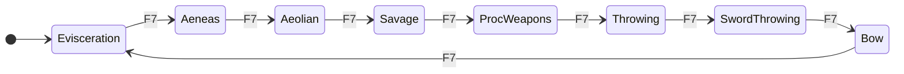

---

## 5. Automation Toggles (Boolean Flags)

These are on/off toggles — no cycling.

### AmbushMode (THF-Specific)
When active, overlays `sets.Ambush` on the engaged melee set and on weaponskills (when not under Sneak/Trick Attack).
- **Default:** Off
- **Recommended keybind:** `Win+F10` (commented out in gear file — `gs c toggle AmbushMode`)

---

### AutoWSMode
Automatically uses the `autows` weaponskill (`"Rudra's Storm"`) when TP is ready. For ranged weapon sets, uses `rangedautows` (`"Last Stand"`) instead. Actual WS used depends on the active Weapons set (see `autows_list`).
- **Default:** Off
- **Keybind:** `Alt+Win+Ctrl+F7`

---

### AutoFoodMode
Automatically uses food (`autofood = 'Soy Ramen'`).
- **Default:** Off
- **Keybind:** `Alt+Ctrl+F7`

---

### AutoStunMode
Automatically uses stun abilities/spells.
- **Default:** Off
- **Keybind:** `Ctrl+F8`

---

### AutoTrustMode
Automatically summons trusts.
- **Default:** Off
- **Keybind:** `Ctrl+Win+Alt+F8`

---

### AutoDefenseMode
Automatically activates a defense set when taking damage.
- **Default:** Off
- **Keybind:** `Alt+F8`

---

### AutoShadowMode
Automatically recasts Utsusemi shadows (relevant when sub NIN).
- **Default:** Off
- **Command:** `gs c toggle AutoShadowMode`

---

### Capacity
Keeps the Capacity Mantle equipped and uses Capacity Rings.
- **Default:** Off
- **Keybind:** `Ctrl+Z`

---

### Kiting
Keeps movement-speed gear equipped.
- **Default:** Off
- **Keybind:** `Alt+F10`

---

### AutoBuffMode (cycle)
Automatically maintains self-buffs. On THF, only active when sub WAR.

| Option | Buffs Maintained |
|--------|-----------------|
| `Off` | *(default)* No automatic buffing |
| `Auto`/other | If sub WAR: maintains Berserk and Aggressor |

**Keybind:** `Win+Pause` — cycle AutoBuffMode

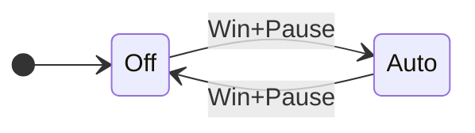

---

### AutoSambaMode (cycle)
Controls automatic Haste Samba usage in combat.
- **Command:** `gs c cycle AutoSambaMode`
- Configured via `init_job_states` as a cycled state.

---

## 6. Active Buff States (Auto-tracked)

These are **not cycled by the player** — they update automatically based on active game buffs and influence gear sets dynamically.

| State | Gear Effect |
|-------|-------------|
| `Sneak Attack` | Overrides idle/engaged gear with `sets.buff['Sneak Attack']`; applies `.SA` WS variant; also adds TH gear if TreasureMode is SATA or Fulltime |
| `Trick Attack` | Overrides idle/engaged gear with `sets.buff['Trick Attack']`; applies `.TA` or `.SATA` WS variant; also adds TH gear if TreasureMode is SATA or Fulltime |
| `Feint` | Overlays `sets.buff.Feint` after aftercast completes |
| `Aftermath: Lv.3` | Appends `'AM'` to CustomMeleeGroups for Vajra AM engaged set variant |
| `Doom` | Equips Doom-counter gear via `sets.buff.Doom` |
| `Sleep` | Equips `sets.buff.Sleep` (e.g. Frenzy Sallet for sleep resistance) |

> **SATA Priority:** If both Sneak Attack and Trick Attack are active, `get_custom_wsmode()` returns `'SATA'`, selecting the `.SATA` WS sub-variant.

---

## 7. Full State Map

```mermaid
graph TD
    THF[THF State Machine]

    THF --> OFFENSE[Offense]
    THF --> DEFENSE[Defense]
    THF --> TH[Treasure Hunter]
    THF --> WEAPONS[Weapons]
    THF --> AUTOMATION[Automation]
    THF --> BUFFS[Active Buffs]

    OFFENSE --> OM[OffenseMode\nNormal / SomeAcc / Acc / FullAcc / Fodder]
    OFFENSE --> HM[HybridMode\nNormal / DT]
    OFFENSE --> WM[WeaponskillMode\nMatch / Normal / DT / SomeAcc / Acc / FullAcc / Fodder / Proc]
    OFFENSE --> RM[RangedMode\nNormal / Acc]
    OFFENSE --> EMM[ExtraMeleeMode\nNone / Suppa / DWMax / Parry]
    OFFENSE --> AMB[AmbushMode Toggle]

    DEFENSE --> IDL[IdleMode\nNormal / Sphere]
    DEFENSE --> PDT[PhysicalDefenseMode\nPDT]
    DEFENSE --> MDT[MagicalDefenseMode\nMDT]
    DEFENSE --> MEVA[ResistDefenseMode\nMEVA]
    DEFENSE --> KIT[Kiting Toggle]

    TH --> TRM[TreasureMode\nFulltime / None / Tag / SATA]

    WEAPONS --> WPN[Weapons\nEvisceration / Aeneas / Aeolian / Savage\nProcWeapons / Throwing / SwordThrowing / Bow]

    AUTOMATION --> ABM[AutoBuffMode\nOff / Auto]
    AUTOMATION --> ASM[AutoSambaMode]
    AUTOMATION --> AWS[AutoWSMode Toggle]
    AUTOMATION --> AST[AutoStunMode Toggle]
    AUTOMATION --> AFD[AutoFoodMode Toggle]
    AUTOMATION --> ATR[AutoTrustMode Toggle]
    AUTOMATION --> ADM[AutoDefenseMode Toggle]
    AUTOMATION --> ASH[AutoShadowMode Toggle]
    AUTOMATION --> CAP[Capacity Toggle]

    BUFFS --> SA[Sneak Attack\nSA WS variant + TH gear]
    BUFFS --> TA[Trick Attack\nTA/SATA WS variant + TH gear]
    BUFFS --> FNT[Feint\nFeint gear overlay]
    BUFFS --> AM3[Aftermath Lv.3\nAM melee group - Vajra]
    BUFFS --> DOOM[Doom]
    BUFFS --> SLP[Sleep]
```

---

## 8. Quick-Reference Cheat Sheet

| F-Key | Modifier | Action |
|-------|----------|--------|
| F7 | — | Cycle Weapons |
| F7 | Alt+Win+Ctrl | Toggle AutoWSMode |
| F8 | Ctrl | Toggle AutoStunMode |
| F8 | Alt | Toggle AutoDefenseMode |
| F8 | Ctrl+Win+Alt | Toggle AutoTrustMode |
| F9 | — | Cycle OffenseMode |
| F9 | Ctrl | Cycle HybridMode |
| F9 | Win | Cycle RangedMode |
| F9 | Alt | Cycle WeaponskillMode |
| F10 | — | Set DefenseMode → Physical |
| F10 | Ctrl | Cycle PhysicalDefenseMode |
| F10 | Win | *(optional)* Toggle AmbushMode |
| F10 | Alt | Toggle Kiting |
| F11 | — | Set DefenseMode → Magical |
| F11 | Ctrl | Cycle MagicalDefenseMode |
| F11 | Alt | Cycle ExtraMeleeMode |
| F12 | — | Set DefenseMode → Resist |
| F12 | Ctrl | Cycle ResistDefenseMode |
| F12 | Win | Cycle IdleMode |
| F12 | Alt | Reset DefenseMode (off) |
| F12 | Ctrl+Win+Alt | Reload GearSwap |
| Pause | — | Update/refresh gear |
| Pause | Win | Cycle AutoBuffMode |

| Other Key | Modifier | Action |
|-----------|----------|--------|
| `` ` `` | Ctrl | *(optional)* `/ja "Flee" <me>` |
| `` ` `` | Alt | *(optional)* `/ra <t>` |
| `` ` `` | Win | *(optional)* Cycle SkillchainMode |
| Backspace | Ctrl | *(optional)* `/item "Thief's Tools" <t>` |
| Backspace | Alt | *(optional)* `/ja "Hide" <me>` |
| `\` | Ctrl | *(optional)* `/ja "Despoil" <t>` |
| `\` | Alt | *(optional)* `/ja "Mug" <t>` |
| Q | Ctrl | *(optional)* Weapons → ProcWeapons |
| Q | Alt | *(optional)* Weapons → SwordThrowing |
| R | Ctrl | *(optional)* Weapons → Default |
| R | Alt | *(optional)* Weapons → MagicWeapons |
| T | Ctrl | Cycle TreasureMode |
| Z | Ctrl | Toggle Capacity |
| Y | Ctrl | Toggle AutoCleanupMode |
| F7 | Alt+Ctrl | Toggle AutoFoodMode |

> **Note:** Entries marked *(optional)* correspond to commented-out binds in the gear file. Uncomment `send_command('bind ...')` lines in `user_job_setup()` to activate them.
